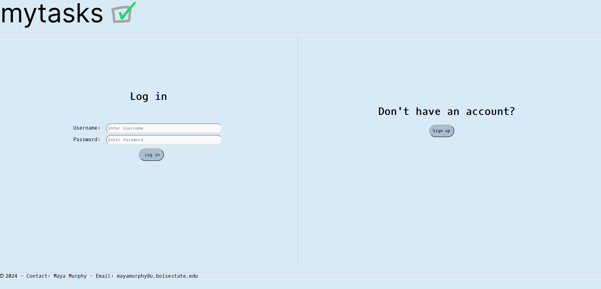
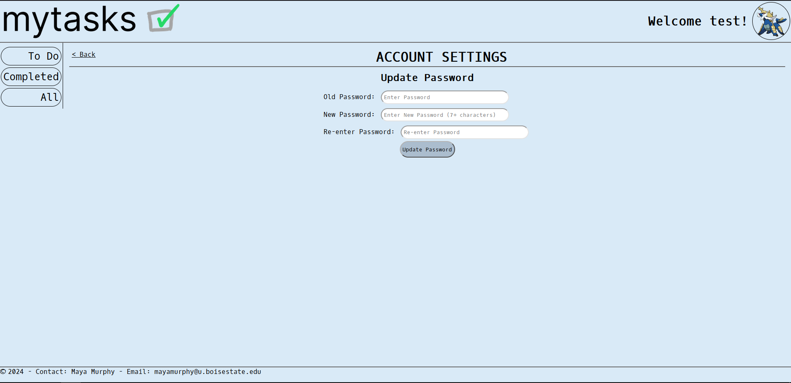

# mytasks | CS408 Project | Spring  2024
### Description/Discussion:
This project is an accumulation of what I'd learned in CS408 - 
Intro to Web Development at Boise State University. 
This course focused on *PHP, HTML, CSS, MySQL, JavaScript, and jQuery*. 
This website is a task manager where you can personalize your profile, 
add, update, and delete tasks, and keep track of how many tasks you've 
completed throughout the day. This is a very rudimentary CRUD 
(create, read, update, delete) website with minimal design efforts, 
considering I was a full-time student when I completed this project. 
 
**Please note that `Dao.php` contains an encrypted host key that was once 
used when I presented this website for my final project. It is no longer
hosted and the key is invalid. I would *NEVER* commit that in an actual 
production environment.**

### Run:
- Prerequisite: Wamp Server (install here: https://www.wampserver.com/en/)
1. Clone repo in `www/` for Wamp Server
2. Run Wamp Server
3. Navigate to `localhost/mytasks`

### Demo Images:

---

#### [Github page](https://github.com/mayamurphy)
